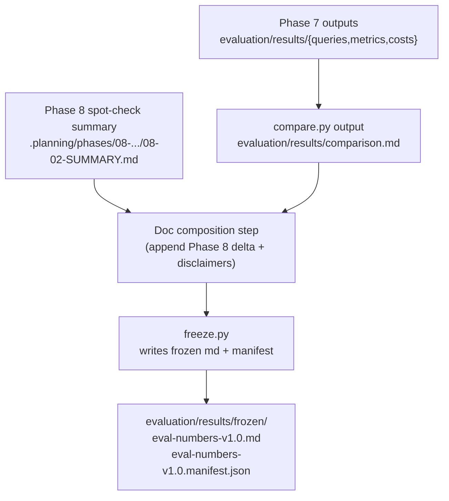

# Phase 9: Frozen Handoff Doc - Research

**Researched:** 2026-05-08  
**Domain:** Documentation freeze + provenance handoff  
**Confidence:** HIGH

## User Constraints (from CONTEXT.md)

No `*-CONTEXT.md` found for Phase 9. [VERIFIED: repo state via file listing]

<phase_requirements>
## Phase Requirements

| ID | Description | Research Support |
|---|---|---|
| DOC-01 | Produce `evaluation/results/frozen/eval-numbers-v1.0.md` containing the full per-tier rollup table (faithfulness, answer_relevancy, context_precision, mean_latency_s, total_cost_usd, cost_per_query_usd, n, n_nan) | Already present in `evaluation/results/comparison.md` under “Tier Rollup”. [VERIFIED: `evaluation/results/comparison.md`] |
| DOC-02 | Include a per-question-class breakdown (single-hop / multi-hop / multimodal), matching `comparison.md` format | Already present in `evaluation/results/comparison.md` under “Per-Question-Class Rollup”. [VERIFIED: `evaluation/results/comparison.md`] |
| DOC-03 | Include per-tier provenance (capture timestamp, generation model, git SHA, judge model) sufficient to reproduce | `evaluation/results/comparison.md` already contains judge model + per-tier capture provenance (timestamp/model/git) and embedder fields. [VERIFIED: `evaluation/results/comparison.md`] |
| DOC-04 | Honest disclaimers: sample-size limits, self-grading bias (with Phase 8 delta evidence), multimodal limitation, embedder-confound table, residual NaN reasons | `comparison.md` already includes sample-size + multimodal + self-grading acknowledgement + embedder table + NaN breakdown; Phase 8 delta evidence lives in `.planning/phases/08-multi-judge-spot-check/08-02-SUMMARY.md` and should be embedded into the frozen doc verbatim (or summarized with exact numbers). [VERIFIED: `evaluation/results/comparison.md`, `.planning/phases/08-multi-judge-spot-check/08-02-SUMMARY.md`] |
| DOC-05 | Copy/paste frozen doc into blog repo with all numbers + disclosures traveling together (no external lookups) | Recommendation: make `evaluation/results/frozen/eval-numbers-v1.0.md` fully self-contained by inlining (not linking) all required tables + the Phase 8 delta table + all disclaimers. [ASSUMED] (depends on blog repo conventions; requirement statement is the contract) |
</phase_requirements>

## Summary

Phase 9 is a **composition + freeze** problem, not a new evaluation run. The “numbers” core is already present in `evaluation/results/comparison.md`: tier rollup, per-class breakdown, per-tier provenance, embedder table, NaN breakdown, and base disclaimers. [VERIFIED: `evaluation/results/comparison.md`]

The only required content that is **not already in `comparison.md`** is the **multi-judge spot-check delta** (Phase 8) and explicit “honest disclaimers” language that cites that delta as evidence. The canonical Phase 8 delta numbers are already written in `.planning/phases/08-multi-judge-spot-check/08-02-SUMMARY.md` (including per-tier mean deltas and the exact spend). [VERIFIED: `.planning/phases/08-multi-judge-spot-check/08-02-SUMMARY.md`]

**Primary recommendation:** Treat `evaluation/results/comparison.md` as the source-of-truth draft, append a “Multi-judge spot-check (Phase 8)” section containing the delta table + cost + provenance, then run `evaluation/harness/freeze.py` to produce `evaluation/results/frozen/eval-numbers-v1.0.md` plus the sidecar manifest. [VERIFIED: freeze tool behavior described in ROADMAP/REQUIREMENTS; Phase 4 delivered refuse-to-clobber + manifest] [ASSUMED: workflow choice “append to comparison.md before freezing” is acceptable]

## Architectural Responsibility Map

| Capability | Primary Tier | Secondary Tier | Rationale |
|---|---|---|---|
| Produce frozen markdown handoff doc | Repo artifacts (docs) | — | Output is a static markdown artifact under `evaluation/results/frozen/`. |
| Ensure provenance + immutability guarantees | Freeze tool (`evaluation/harness/freeze.py`) | Docs process | Freeze tool provides refuse-to-clobber + sidecar manifest; process ensures content completeness before freezing. |
| Incorporate multi-judge delta evidence | Docs process | Phase 8 artifacts | Delta numbers are already computed; Phase 9 should only render them. |

## Standard Stack

This phase should use **no new libraries**. [VERIFIED: Phase 9 scope in ROADMAP + existing artifacts]

### Core
| Library | Version | Purpose | Why Standard |
|---|---:|---|---|
| (none) | — | — | Phase is doc composition using existing markdown outputs. |

### Supporting
| Library | Version | Purpose | When to Use |
|---|---:|---|---|
| `evaluation/harness/freeze.py` | (repo local) | Write frozen doc + sidecar manifest; refuse to clobber | Always for `eval-numbers-v1.0.md` creation (DOC-01..03 + SC-6 in ROADMAP Phase 9). [VERIFIED: ROADMAP Phase 4/9 text; REQUIREMENTS HARN-03/HARN-04] |

## Architecture Patterns

### System Architecture Diagram

### Recommended Project Structure

No new structure is required. Outputs are already standardized:

- `evaluation/results/comparison.md` (source-of-truth draft) [VERIFIED: file exists]
- `evaluation/results/frozen/` (target output directory) [VERIFIED: `.gitkeep` exists]
- `.planning/phases/08-multi-judge-spot-check/08-02-SUMMARY.md` (Phase 8 delta evidence) [VERIFIED: file exists]

### Pattern: “Freeze from a single upstream markdown”
**What:** Build a single upstream markdown (`comparison.md`) that already contains every table + disclaimer; freeze tool then copies it byte-for-byte and records provenance in manifest.  
**When to use:** When immutability/refuse-to-clobber and manifest provenance are required.  
**Example:** `freeze.py` copies `comparison.md` to `frozen/eval-numbers-vX.Y.md` and writes `frozen/eval-numbers-vX.Y.manifest.json`. [VERIFIED: ROADMAP Phase 4; REQUIREMENTS HARN-03/HARN-04]

### Anti-Patterns to Avoid
- **Editing the frozen file after freezing:** breaks the “frozen artifact = exact source snapshot” mental model and can diverge from manifest provenance. Prefer finalizing upstream (`comparison.md`) before freezing. [ASSUMED] (policy preference; technically possible but undermines auditability)
- **Re-running Tier 4 ingestion / graph rebuild:** explicitly forbidden by current state notes (“DO NOT rebuild Tier 4 between this point and Phase 9 freeze”). [VERIFIED: `.planning/STATE.md` line 6]
- **Recomputing numbers in Phase 9:** Phase 9 should only render already-produced outputs (Phase 7/8). [VERIFIED: Phase 9 description in ROADMAP]

## Don't Hand-Roll

| Problem | Don't Build | Use Instead | Why |
|---|---|---|---|
| Freeze semantics (refuse clobber, manifest provenance) | Custom scripts or ad-hoc copy commands | `evaluation/harness/freeze.py` | Already exists, tested, and encodes the project’s provenance contract. [VERIFIED: ROADMAP Phase 4; REQUIREMENTS HARN-03/HARN-04] |

## Runtime State Inventory

Not a rename/refactor/migration phase. Omitted.

## Common Pitfalls

### Pitfall: Multi-judge artifact not persisted under `evaluation/results/`
**What goes wrong:** Phase 8 live run staged the spot-check JSON under a temp directory; it may not exist under `evaluation/results/metrics/`, so Phase 9 can’t “just link a file” unless you explicitly persist it. [VERIFIED: `evaluation/results/metrics/` listing shows no `multi-judge-spotcheck-*.json`; Phase 8 summary shows tmp_path staging]
**How to avoid:** For Phase 9, embed the Phase 8 delta table directly into the frozen markdown (using exact values from `.planning/phases/08-multi-judge-spot-check/08-02-SUMMARY.md`) OR re-run `multi_judge_spotcheck.amain` in a non-temp `--results-dir evaluation/results` mode if policy allows regenerating the artifact without changing source capture. [ASSUMED] (re-run policy; would spend money)
**Warning signs:** You’re about to write a disclaimer that points to a JSON path that doesn’t exist in-repo.

### Pitfall: “Judge cost $0” ledger confusion
**What goes wrong:** RAGAS judge cost ledgers report `$0` due to a known LiteLLM usage parsing gap, while capture ledgers have real spend. [VERIFIED: Phase 7 summary “LiteLLM token-parser gap”; `evaluation/results/costs/ragas-judge-tier-*-*.json` present and small/consistent size]
**How to avoid:** In disclaimers, explicitly state that judge spend is underreported in the ledgers (known v1.1 hardening item) and prefer citing the Phase 7 “honest total” when available (07-03 summary). [VERIFIED: `.planning/phases/07-full-5-tier-rerun/07-03-SUMMARY.md`]
**Warning signs:** Frozen doc implies “RAGAS judging was free” based on `$0` ledgers.

## Code Examples

No new code is required for Phase 9; this is a docs composition phase. [VERIFIED: ROADMAP Phase 9 framing]

## State of the Art

| Old Approach | Current Approach | When Changed | Impact |
|---|---|---|---|
| Manually copy numbers into blog post | Freeze a single immutable doc with manifest | Phase 4 | Makes provenance auditable and reduces copy drift. [VERIFIED: ROADMAP Phase 4/9] |

## Assumptions Log

| # | Claim | Section | Risk if Wrong |
|---|---|---|---|
| A1 | It’s acceptable to append Phase 8 delta content to `evaluation/results/comparison.md` before freezing. | Summary; Anti-Patterns | If unacceptable, Phase 9 needs a different source markdown (e.g. a dedicated “handoff.md”) and freeze tool source selection must be adjusted. |
| A2 | Phase 9 should embed (not link) Phase 8 delta numbers to satisfy “no external lookups required”. | Phase Requirements (DOC-05) | If links are allowed, the doc could be smaller; if not, missing embedding fails DOC-05. |

## Open Questions (RESOLVED)

1. **Should Phase 9 persist the Phase 8 spot-check JSON into `evaluation/results/metrics/`? — RESOLVED**
   - **Decision:** Do **not** re-run or persist the JSON by default for v1.0. (Phase 9 is composition + freeze; no live spend.)
   - **Implementation:** Inline the Phase 8 delta table + provenance directly into `evaluation/results/comparison.md` from `.planning/phases/08-multi-judge-spot-check/08-02-SUMMARY.md`, then freeze.
   - **Rationale:** Keeps the frozen doc self-contained (DOC-05) without relying on a possibly-missing JSON artifact; avoids any additional paid calls.

## Environment Availability

SKIPPED (no external dependencies identified beyond existing repo scripts and files).

## Validation Architecture

No new test infrastructure is required; Phase 9 should validate by **content checks**:

- `evaluation/results/frozen/eval-numbers-v1.0.md` exists
- contains Tier Rollup + Per-Question-Class Rollup tables
- contains embedder-by-tier table
- contains NaN breakdown + disclaimers
- contains a Multi-judge delta section with the Phase 8 numbers (tier-1/tier-4/tier-5 and overall)
- `evaluation/results/frozen/eval-numbers-v1.0.manifest.json` exists beside it and freeze refuses clobber on re-run

[VERIFIED: output contracts specified in ROADMAP Phase 9 + REQUIREMENTS DOC-01..05; freeze refusal/manifest in HARN-03/HARN-04]

## Security Domain

This phase is documentation-only and does not introduce new auth/session/access control surfaces. Primary risk is **accidentally leaking secrets** by copy/pasting environment variables, API keys, or internal IDs into the frozen markdown. [ASSUMED] (general risk; no incident observed)

## Sources

### Primary (HIGH confidence)
- `evaluation/results/comparison.md` — confirms existing tables + provenance/disclaimers already emitted.
- `.planning/ROADMAP.md` — Phase 9 success criteria and required doc contents.
- `.planning/REQUIREMENTS.md` — DOC-01..DOC-05 definitions.
- `.planning/phases/07-full-5-tier-rerun/07-03-SUMMARY.md` — sweep_sha, cost/provenance caveats (judge $0 gap), and “do not rebuild Tier 4” context.
- `.planning/phases/08-multi-judge-spot-check/08-02-SUMMARY.md` — canonical multi-judge delta numbers + cost + dual-SHA provenance.
- `.planning/STATE.md` — freeze prerequisite: do not rebuild Tier 4 before Phase 9 freeze.

## Metadata

**Confidence breakdown:**
- Standard stack: HIGH — no new deps; freeze tool is already implemented and referenced.
- Architecture: HIGH — explicit artifact flow is already established (Phase 7/8/4).
- Pitfalls: HIGH — grounded in current repo state (missing persisted spotcheck JSON; known cost-ledger gap).

**Research date:** 2026-05-08  
**Valid until:** 30 days

